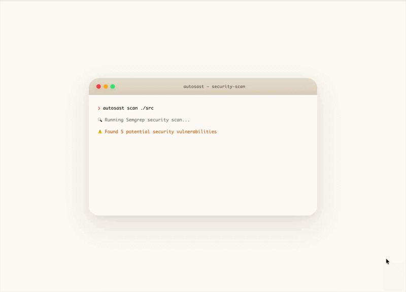

<p align="center">
  
  
  
</p>

<h1 align="center">
<<<<<<< HEAD
  
=======
  
>>>>>>> 54a032e (Update)
  AutoSAST
</h1>

<p align="center">
  <strong>Stop drowning in false positives. Fix the real vulnerabilities quickly.</strong>
</p>

<p align="center">
  <em>AI-Powered Static Analysis Triage that thinks like a security engineer.</em>
</p>

<p align="center">
  <a href="USER_GUIDE.md">📚 Complete User Guide</a>
</p>

---

## The Problem

You ran Semgrep. Now you're staring at **hundreds of findings**.

Half of them look like this:
```
⚠️  SQL Injection in AccountHandler.java:32
⚠️  SQL Injection in SecureReportHandler.java:37  ← Actually sanitized upstream
⚠️  SQL Injection in SecureReportHandler.java:54  ← Also sanitized
⚠️  XSS in AdminController.java:30
⚠️  Weak Crypto in HashUtil.java:14               ← Dead code, never called
```

Sound familiar?

> **Are you sitting on a haystack of false positives?**

You spend hours manually reviewing findings, tracing data flows, checking for sanitization—only to discover most alerts are noise. Meanwhile, the *real* vulnerabilities slip through because you're drowning in false positives.

**What if your SAST tool could think?**

---

## The Solution

**AutoSAST** is an intelligent agent that investigates each finding like a **senior security engineer** would:

- 📖 **Reads the code** — not just the flagged line, but callers, callees, and cross-file dependencies
- 🔍 **Traces data flow** — follows tainted variables through functions and across file boundaries  
- ✅ **Checks sanitization** — detects 60+ sanitization patterns (SQL, XSS, SSRF, Path Traversal)
- 🧠 **Reasons about context** — understands when parameterized queries, encoding, or validation makes a finding safe

The result? **60%+ false positive reduction** with **100% accuracy** on verified testbeds.

---

## ⚡ Quick Start

```bash
# Install
pip install -r requirements.txt

# Configure (choose your LLM provider)
export OPENAI_API_KEY=sk-...           # For OpenAI (GPT-4o)
# OR export GEMINI_API_KEY=...        # For Google Gemini
# OR export GROQ_API_KEY=...          # For Groq (fast inference)
# OR export PROVIDER=ollama            # For local Ollama (free, private)

# Run
python -m src.cli scan /path/to/your/code
```

That's it. **No complex setup. No training. No configuration files.**

---

## 🎯 Real Results

From an actual scan on a Java codebase:

| Metric | Before AutoSAST | After AutoSAST |
|--------|-------------|------------|
| **Findings** | 5 alerts | 2 actionable |
| **Time Spent** | Hours of triage | Seconds |
| **False Positives** | Unknown | 0 |
| **Reduction** | — | **60%** |

```
✅ TRUE POSITIVE  AccountHandler.java:32      SQL Injection (unsanitized input)
✅ TRUE POSITIVE  AdminController.java:30     XSS (direct response writer)
❌ FALSE POSITIVE SecureReportHandler.java:37 Sanitized via SecurityUtils.sanitizeForSql()
❌ FALSE POSITIVE SecureReportHandler.java:54 Sanitized via SecurityUtils.sanitizeForSql()
❌ FALSE POSITIVE HashUtil.java:14            Dead code - function never called
```

---

## How It Works

<p align="center">
  
</p>

```
Your Code → Semgrep Scan → 5 Findings → ⚡ AutoSAST Agent → 2 Real Vulnerabilities
                                              ↓
                                    (traces data flow,
                                     checks sanitization,
                                     reasons about context)
```

The agent **iteratively investigates** each finding:

1. **Extract context** — Pull relevant code from the flagged location
2. **Ask guided questions** — Is input sanitized? Is PreparedStatement used?
3. **Call tools on demand** — Request more code, trace callers, search for patterns
4. **Render verdict** — TRUE_POSITIVE, FALSE_POSITIVE, or NEEDS_REVIEW

---

## ✨ Key Features

- 🛡️ **Inter-Procedural Data Flow** - Traces tainted data across functions and files
- 🔍 **Dynamic Context Retrieval** - LLM reads code on demand (callers, callees, definitions)
- 🧹 **Sanitization Detection** - Recognizes 60+ patterns (SQL, XSS, Path Traversal, etc.)
- 🌐 **Multi-Language** - Java, Python, JavaScript/TypeScript
- 🧠 **Agentic Reasoning** - Iteratively gathers evidence with 11 specialized tools
- 🤖 **Multi-LLM** - OpenAI, Gemini, Groq, **Ollama (100% local & free)**, Azure
- 🔗 **Git Repository Support** - Scan GitHub/GitLab repos directly (auto-clone & cleanup)
- 📊 **60%+ False Positive Reduction** - Focus on what actually matters

> **📚 [Read the Complete User Guide](USER_GUIDE.md)** for detailed usage scenarios, best practices, and troubleshooting.

---

## 🛠️ CLI Commands

### Scan Local Codebase
```bash
python -m src.cli scan /path/to/project
python -m src.cli scan . --config auto --limit 10
```

### Scan Git Repository
```bash
# Scan any public Git repository directly
python -m src.cli scan https://github.com/user/repository
python -m src.cli scan https://github.com/user/repo --branch develop
python -m src.cli scan https://gitlab.com/user/project --tag v1.0.0
```

Auto-clones, scans, and cleans up automatically. Works with GitHub, GitLab, Bitbucket, and any Git hosting.
**📖 [Git Repository Guide](GIT_REPOSITORY_SUPPORT.md)** for advanced options and private repo workarounds.

### Other Commands
```bash
# Custom output path
python -m src.cli scan . -o my-custom-report.json

# Detailed per-finding analysis
python -m src.cli scan . --detailed-output

# Filter by severity
python -m src.cli scan . --severity high critical

# View previous results interactively
python -m src.cli view results/scan_project_20260611_143022.json

# Debug context extraction
python -m src.cli context src/Handler.java 42 --rule sql-injection
```

**Note:** Results are automatically saved to `results/` folder with naming convention:
`scan_<target>_<timestamp>.json`

---

## ⚙️ Configuration

Configure via environment variables or `.env` file:

| Variable | Description | Default |
|----------|-------------|---------|
| `PROVIDER` | LLM Provider: `openai`, `azure`, `gemini`, `groq`, `ollama` | `openai` |
| `MODEL` | Model name (e.g., `gpt-4o`, `gemini-1.5-pro`, `qwen2.5:14b`) | `gpt-4o` |
| `OPENAI_API_KEY` | API key for OpenAI (required if PROVIDER=openai) | — |
| `AZURE_OPENAI_API_KEY` | API key for Azure OpenAI (required if PROVIDER=azure) | — |
| `AZURE_OPENAI_ENDPOINT` | Azure OpenAI endpoint URL (required if PROVIDER=azure) | — |
| `GEMINI_API_KEY` | API key for Google Gemini (required if PROVIDER=gemini) | — |
| `GROQ_API_KEY` | API key for Groq (required if PROVIDER=groq) | — |
| `OLLAMA_BASE_URL` | Ollama server URL (optional if PROVIDER=ollama) | `http://localhost:11434` |

### 💡 Supported LLM Providers

- **OpenAI** (GPT-4o) - Most tested ⭐
- **Google Gemini** - Fast and cost-effective
- **Groq** - Ultra-fast inference
- **Ollama** - 100% local and free (recommended: `qwen2.5:14b`)
- **Azure OpenAI** - Enterprise compliance

**📚 [Configuration Guide](USER_GUIDE.md#configuration)** for detailed setup instructions.

---

## 🚀 Why AutoSAST?

| Without AutoSAST | With AutoSAST |
|------------------|---------------|
| ⏰ Hours of manual triage | ⚡ Seconds of automated analysis |
| 😵 Alert fatigue → missed vulnerabilities | 🎯 Focus on what matters |
| 📝 "I'll check it later" → never | ✅ Immediate, confident verdicts |
| 🧠 Tribal knowledge required | 📖 AI reasoning is documented |

---

## 📚 Documentation

- **[Complete User Guide](USER_GUIDE.md)** - Installation, configuration, usage scenarios, best practices
- **[Git Repository Support](GIT_REPOSITORY_SUPPORT.md)** - Scan remote repositories, advanced options
- **[Agent Tools Reference](USER_GUIDE.md#advanced-features)** - 11 specialized code analysis tools

---

<p align="center">
  <strong>Ready to reduce false positives by 60%+?</strong><br>
  <a href="#-quick-start">Get Started →</a> |
  <a href="USER_GUIDE.md">📚 Read the Guide</a>
</p>
